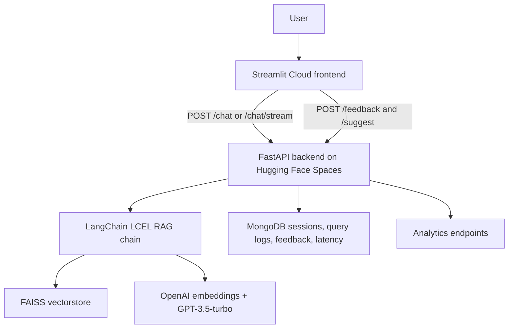

# ChatSolveAI

AI customer-support chatbot built with Streamlit, FastAPI, LangChain, FAISS,
MongoDB, and OpenAI.

- Web app: https://chatsolveai.streamlit.app/
- Backend Space: https://huggingface.co/spaces/Nikollass/chatsolveai-api
- API docs: https://Nikollass-chatsolveai-api.hf.space/docs

## Overview

ChatSolveAI is a full-stack retrieval-augmented generation app for common
customer-support questions. The Streamlit frontend sends chat requests to a
FastAPI backend hosted on Hugging Face Spaces. The backend builds a LangChain
LCEL RAG chain over a curated support knowledge base, retrieves relevant FAISS
documents, streams GPT-3.5-turbo responses, and stores session/analytics data in
MongoDB.

## Architecture



## Features

| Area | What is implemented |
| --- | --- |
| Chat UX | Streamlit chat UI, example prompts, follow-up suggestions, feedback buttons, Markdown transcript export |
| RAG | LangChain LCEL chain, FAISS vectorstore, chat-history question condensation, source documents, confidence score |
| Streaming | FastAPI `/chat/stream` SSE endpoint is available; Streamlit can use blocking `/chat` or streaming mode |
| Persistence | MongoDB-backed sessions, query logs, feedback, and latency samples |
| Security | Configurable CORS origins, optional `X-API-Key` auth, per-route rate limits, PII redaction before storage |
| Retention | MongoDB TTL indexes and capped per-session message arrays |
| Observability | Structured logging and optional Sentry integration |
| CI | GitHub Actions syntax checks and pytest suite |
| Deployment | Dockerized FastAPI backend for Hugging Face Spaces, Streamlit Cloud frontend |

The repository also contains older notebook-oriented modules for hybrid
retrieval, BM25, reranking, intent classification, and evaluation experiments.
The production backend path is the FastAPI + `pipeline/rag.py` LangChain RAG
chain.

## Project Structure

```text
.
├── app.py                       # Streamlit frontend
├── api/                         # FastAPI app, routes, auth, DB, logging
│   ├── main.py
│   ├── database.py
│   ├── models.py
│   └── routes/
├── pipeline/                    # RAG, retrieval, embeddings, evaluation helpers
│   ├── rag.py
│   ├── retrieval.py
│   ├── reranker.py
│   └── evaluate.py
├── tests/                       # Unit and regression tests
├── huggingface/                 # Hugging Face Space metadata/docs
├── .github/workflows/           # CI and keepalive workflows
├── chatbot_responses.json       # Curated RAG corpus
├── predefined_responses.json    # Canonical support answers
├── docker-compose.yml
├── Dockerfile                   # FastAPI backend image
├── Dockerfile.streamlit         # Streamlit frontend image
├── requirements.api.txt
├── requirements.streamlit.txt
└── .env.example
```

## Quick Start

### Docker Compose

```bash
git clone https://github.com/nikaergemlidze1/Automating_Customer_Support_with_OpenAI_API-ChatSolveAI.git
cd Automating_Customer_Support_with_OpenAI_API-ChatSolveAI
cp .env.example .env
```

Edit `.env` and set at least:

```env
OPENAI_API_KEY=sk-...
```

Then start the stack:

```bash
docker compose up --build
```

Open:

- Streamlit UI: http://localhost:8501
- API docs: http://localhost:8000/docs
- Health check: http://localhost:8000/health

### Local Development

```bash
python3 -m venv .venv
source .venv/bin/activate
pip install -r requirements.api.txt -r requirements.streamlit.txt
cp .env.example .env
docker run -d --name chatsolveai-mongo -p 27017:27017 mongo:7
uvicorn api.main:app --reload --port 8000
```

In a second terminal:

```bash
source .venv/bin/activate
streamlit run app.py
```

## Environment Variables

See `.env.example` for the full list. Important settings:

| Variable | Purpose |
| --- | --- |
| `OPENAI_API_KEY` | Required for embeddings and chat completions |
| `MONGO_URL` | MongoDB connection string |
| `API_URL` | Backend URL used by Streamlit |
| `API_KEY` | Optional shared secret sent as `X-API-Key` |
| `ALLOWED_ORIGINS` | Comma-separated CORS allowlist |
| `MONGO_TTL_DAYS` | TTL retention window for stored logs/sessions |
| `MAX_SESSION_MESSAGES` | Per-session message cap |
| `LOG_LEVEL`, `LOG_FORMAT` | Backend logging configuration |
| `SENTRY_DSN` | Optional Sentry error reporting |

## API Reference

The FastAPI backend exposes Swagger UI at `/docs`.

| Method | Endpoint | Description |
| --- | --- | --- |
| `GET` | `/health` | Liveness check |
| `POST` | `/chat` | Blocking chat response |
| `POST` | `/chat/stream` | Server-Sent Events chat stream |
| `POST` | `/suggest` | Follow-up question suggestions |
| `POST` | `/feedback` | Store thumbs up/down feedback |
| `DELETE` | `/chat/session/{session_id}` | Clear one session |
| `GET` | `/analytics` | Aggregate usage stats |
| `GET` | `/analytics/timeseries` | Query counts by day |
| `GET` | `/analytics/intents` | Intent distribution |
| `GET` | `/analytics/latency` | Latency percentiles |
| `GET` | `/analytics/feedback` | Feedback counts |
| `GET` | `/sessions` | Recent sessions |
| `GET` | `/history/{session_id}` | Stored history for one session |

Example:

```bash
curl -X POST http://localhost:8000/chat \
  -H "Content-Type: application/json" \
  -H "X-API-Key: $API_KEY" \
  -d '{"session_id":"demo","query":"How do I reset my password?"}'
```

## Testing

```bash
pytest -q
python3 -m compileall api pipeline tests app.py
```

The test suite covers Pydantic models, PII redaction, lightweight intent logic,
and regression checks. API integration and broader RAG regression coverage are
being expanded in follow-up PRs.

## Deployment Notes

### Hugging Face Spaces Backend

The backend uses `Dockerfile` and expects these Space secrets:

| Secret | Purpose |
| --- | --- |
| `OPENAI_API_KEY` | OpenAI access |
| `MONGO_URL` | MongoDB Atlas or compatible MongoDB URI |
| `API_KEY` | Shared frontend/backend secret |
| `ALLOWED_ORIGINS` | Production Streamlit origin allowlist |

### Streamlit Cloud Frontend

The Streamlit app should be configured with:

| Secret | Purpose |
| --- | --- |
| `API_URL` | Hugging Face backend URL |
| `API_KEY` | Same shared secret as backend |

### GitHub Actions

The repository uses GitHub Actions for CI and keepalive pings. If using the
deploy workflow, configure:

| Name | Type | Purpose |
| --- | --- | --- |
| `HF_TOKEN` | Secret | Token with permission to restart the Hugging Face Space |
| `HF_SPACE_ID` | Variable | Optional override, defaults to `Nikollass/chatsolveai-api` |
| `CHATSOLVEAI_API_KEY` | Secret | Optional keepalive auth header for protected `/chat` |

## Demo Questions

- How do I reset my password?
- Where is my order?
- How do I get a refund?
- How do I cancel my subscription?
- What payment methods do you accept?

## Notebook

`notebook.ipynb` contains the original educational workflow for embeddings,
similarity search, chatbot routing, retrieval metrics, and diagnostics. Treat
the notebook as research context; the deployed backend is the FastAPI service.

## Author

Nika Ergemlidze
